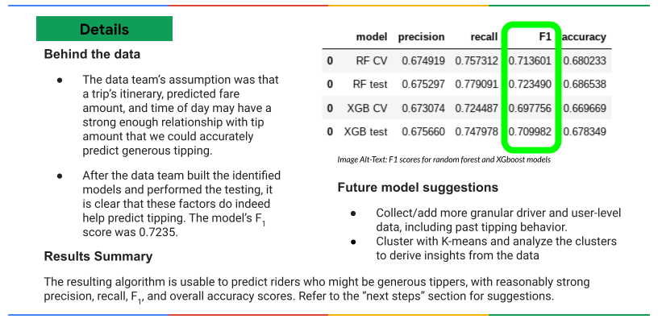
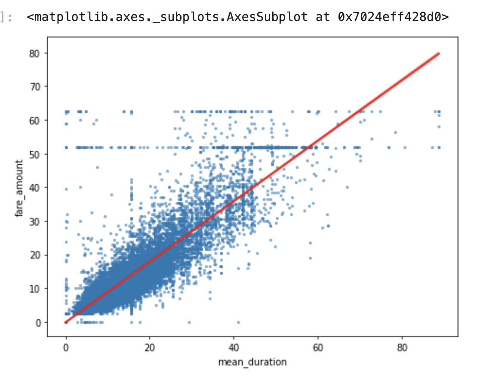

# Selected Projects in Data Science, Machine Learning, and NLP

## Automatidata: NYC Taxi Fare Estimator

In this project, as a component of the [Google Advanced Data Analytics Professional Certificate](https://www.coursera.org/professional-certificates/google-advanced-data-analytics), I created an app for the New York City Taxi and Limousine Commission (TLC) that allows passengers to forecast taxi fares. I constructed and assessed regression models to `anticipate fare costs, alongside implementing XGB and cross-validated random forest models to predict tipping patterns.

#### Key Features

- **Project Proposal:** Defined the fare estimation app's scope, milestones, and tasks.
- **Data Understanding:** Identified necessary datasets and explored key variables.
- **Exploratory Data Analysis (EDA):** Cleaned, feature-engineered, and visualized data to uncover patterns.
- **Statistical Testing:** Conducted hypothesis testing to validate data assumptions.
- **Regression Models:** Built and evaluated regression models to predict fare amounts.
- **Machine Learning Models:** Developed machine learning models to predict tipping behavior.

  
  

 
[View Github Repository](https://github.com/Kian1369/Automatidata-NYC-Taxi-Fare-Prediction-App)

## Naive Machine Translation and Locality Sensitive Hashing (LSH)

In this project, which was the last section of the NLP specialization with classification and vector spaces authorized by DeepLearning.AI, I implemented and developed a machine translation system to translate English words to French using word embeddings and vector space models. The project involved the following key steps:

- Generated **embedding and transformation matrices** for English and French words.
- Implemented a **linear transformation** to convert English word embeddings to French embeddings.
- **Minimized the translation error** by computing and optimizing a transformation matrix using the **Frobenius norm loss function**.
- Achieved a **56% accuracy** on Unseen Data by using some basic linear algebra and learning a mapping of words from one language to another.
- Applied **Locality Sensitive Hashing (LSH)** to perform an efficient document search and find similar tweets for Document Search.
 
[View Github Repository](https://github.com/Kian1369/Natural-Language-Processing-with-Classification-and-Vector-Spaces/tree/main/Naive%20Machine%20Translation%20and%20Locality%20Sensitive%20Hashing%20(LSH))

## Comprehensive EDA, Churn Cohort Analysis, and Customer Churn Prediction

In this project, I utilized `tree-based` and `boosting machine learning methods` to predict customer churn for a telecommunications company. The analysis began with a detailed exploratory data analysis to understand the dataset and identify key factors contributing to churn. I also conducted a comprehensive churn cohort analysis to examine customer behavior over different ranges of time and identify trends in churn rates.

  
  

<be>

### Results

By implementing and comparing models such as Decision Trees, Random Forests, Gradient Boosting Machines, and Adabooster, I achieved improvements in predictive accuracy. The results from both the predictive modeling and the cohort analysis provide valuable insights for developing strategies to retain customers and reduce churn rates.

[View Github Repository](https://github.com/Kian1369/Customer-Churn-Prediction-Using-Tree-Based-and-Boosting-Models)

## Handwritten digits Recognition with Principal Component Analysis (PCA)

The goal of this project was to identify which handwritten digits are most differentiated using Principal Component Analysis (PCA). This project simulates a scenario where an image recognition service is implemented for a postal service to automatically read handwritten digits, improving efficiency and accuracy over human recognition.

  
  

 
   
### Results

The PCA transformation reduced the data dimensionality from `64` to `2` and then `3 principal components`, explaining approximately `21.6% and 30%` respectively of the total variance in the dataset. This project demonstrates the use of PCA to analyze and differentiate handwritten digits, which can significantly improve the performance of an image recognition system for a postal service.

[View Github Repository](https://github.com/Kian1369/Identifying-handwritten-digits-with-Principal-Component-Analysis-Project)

